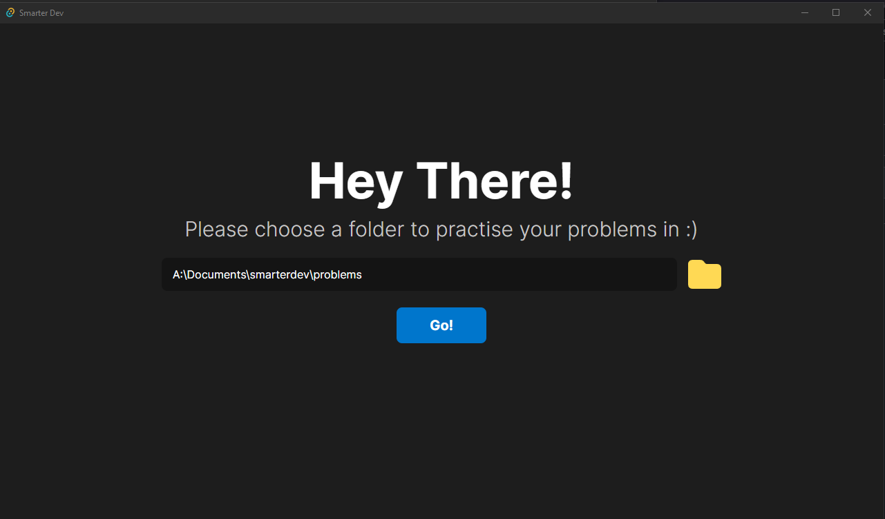
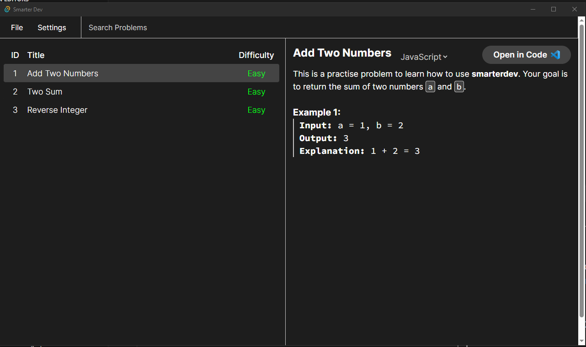
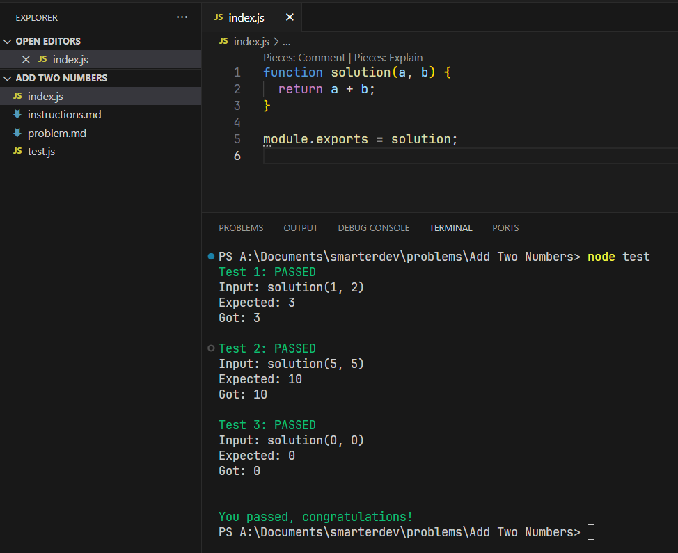

# SmarterDev Desktop

This provides leetcode style problems you can solve and test on your local machine.

    
    
    

Currently all problems can be defined in the [problems.ts](https://github.com/conaticus/smarterdev-desktop/blob/main/src/problems.ts) file.

This is a very rough prototype and I currently don't plan to continue this, here is a roadmap anyway, I might come back to it one day:

- Templating for different language tests & markdown files (at the moment there is a very ugly string formatter that is hardcoded into [ProblemDetails.tsx](https://github.com/conaticus/smarterdev-desktop/blob/main/src/components/ProblemDetails.tsx))
- Better problem format that is more user friendly
- Sharable JSON problems that can be installed with a custom installer
- `orderMatters` option in a problem so that array tests will return true even if the order is incorrect
- Display best the achievable time complexity for the problem so that users know what to aim towrads
- Online server that runs your code and ranks you on a efficiency leaderboard (this might be difficult to make accurate)
- Ability to view other people's solutions
